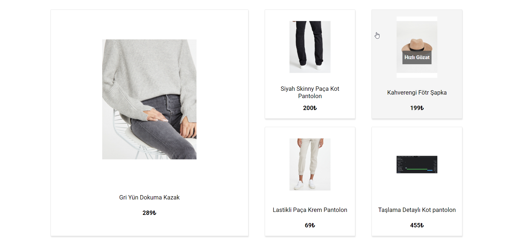

## Content

- [Introduction](#introduction)
- [Technologies Used](#technologies-used)
- [Installation](#installation)
- [Previews](#previews)
- [About Grid System](#grid)

<br>

# Introduction

- Kobisi product list. I used json-server for backend api. 
- You can reach to json file from src/data/list.json
- This app has own grid system like Bootstrap. You can create new responsive design with class name.


<br>

## Technologies Used

- Vue
- Axios
- Json-server
- SASS 

<br>

## Installation

- First, clone the project:

```sh
git clone https://github.com/yigitden/Kobisi-product-list.git
```

- Then, start the project on localhost:

```bash
# install dependencies with npm
npm install
# or install dependencies with yarn
yarn

# run json-server
npx json-server --watch src/data/list.json --port 3001

- You can change your port what you want instead 3001.
Api url defined 3001 as a default. You can change your api url from App.vue on 49 line.

# serve at localhost:8080
npm run serve
```
 
<br>
<br>

# Previews

<center>

## Web - Main Page



## Web - Modal


## Web - Mobile

 
 
 

# Grid

- Breakpoints
Grid System's breakpoints. These values have set up as a minimum value
```sh
    xs:0,
    sm:576px,
    md:760px,
    lg:960px,
    xl:1200px,
```

If you had used Bootstrap before, these define are similar for you. 
These class names will help you while creating a responsive website
```sh

.container{
    width: 100%;
    max-width: 1300px;
    margin: 0 auto; 
    padding: 0 20px;
    box-sizing: border-box;
};
.column{
    display: flex;
    flex-flow: column wrap;
}
.row {
    display: flex;
    flex-flow: row wrap;
};
```

This grid system has 12 column. You can use 'col' class name with column number and name of breakpoints.
```sh

col-12-xs  ->  12 columns for min 0px

col-6-md   ->  6 columns for min 760px

col-2-lg   ->  2 columns for min 960px

```

if you want to add flex,block or inline feature to your div, you can use these class names with name of breakpoints ;

```sh

d-flex-xs -> you can add display:flex feature to your div for min 0px

d-flex-md -> you can add display:flex feature to your div for min 760px

d-block-lg -> you can add display:blok feature to your div for min 960px

justify-center-xs  -> you can add justify-content:center feature to your div for min 0px

justify-space-evenly-md   -> you can add justify-content:space-evenly feature to your div for min 760px

justify-space-between-xl  -> you can add justify-content:space-between feature to your div for min 1200px

You can use align-items feature same way justify-content. Like align-center-md or align-center-lg ...

You can manage your flex direction with class. For example;

flex-row-xl

flex-column-md

flex-row-reverse-xs

```

- Base values
```sh
Base padding and margin values;

$base-padding: 0.75rem;
$base-margin: 0.75rem;

Base border values;

$base-border-thickness: 1px;
$base-border-radius: 20px; 

Base box-shadow values;

$base-box-shadow: 1px 3px 3px rgba(0,0,0,0.1);

Base font size values;

$base-font-size: 1rem;
$font-size-sm:$base-font-size * 0.75;
$font-size-lg:$base-font-size * 1.5;
$font-size-xl:$base-font-size * 2;
$font-size-xxl:$base-font-size * 3; 
```